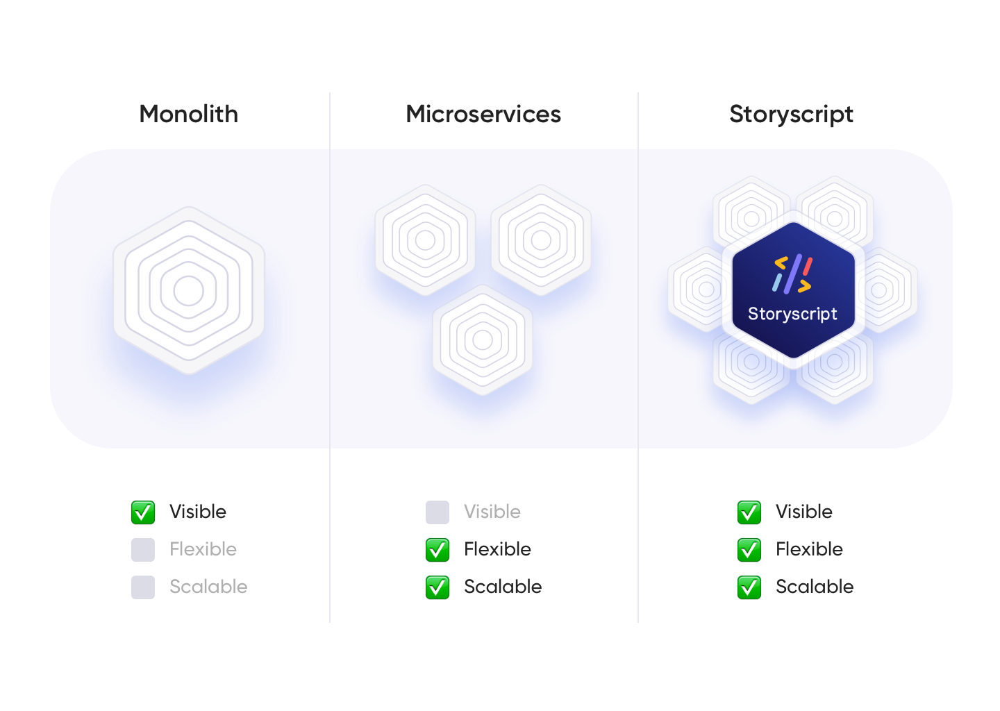

# Introduction

## Meet Storyscript

✨Storyscript is the cloud-native, polyglot programming language that seamlessly moves data between microservices and functions with zero-devops deployments into Kubernetes so you can stay focused on what matters most: business-logic. ✨

Let's start with the code. The snippet below shows the most important feature of Storyscript.

```coffeescript
when service action event key:value as event  # Event-driven microservice
  res = service action key:value              # Call microservice action
  result = someFunction(key:value)            # Call function (any language)
  someString.upper().split(by:' ')            # Cal data transformation
```
::: tip Storyscript key features:
- Strongly-typed.
- Turing-complete.
- Microservice orchestrator.
- Distributed monolith.
- Glue code between microservices and serverless functions.
- Cloud-native compiled with zero-devops deployments.
- Polyglot development (it **does not** replace high-level languages it connects them)
:::

The code above would be your business-logic. After all, applications are stories of data; how you move data is what makes your application unique. Write your business-logic as Stories in Storyscript and deploy directly into Kubernetes with zero-configuration.

The design of Storyscript is to **move data**, with no boilerplate code, in a declarative and intuitive way. Inspired by many popular languages to be as natural and intuitive as possible. It is declarative, strong-typed, static-typed and focused on top-level data-flow.

## Why Storyscript?

Software development is a 90 year story of abstraction. Once physical punch cards were used to automate procedures turned into code enabling millions of people to call themselves developers. Modern development is built upon the foundation of well-abstracted stacks of software, a trend that is not gong to stop. Abstraction, to developers, means staying focused on what matters most. How one manages memory or threads is not business-logic. It's the story of moving data that defines our products, our businesses, our development and our lives. *Everything else is noise.*

### The next abstraction: Top-level Programming

**Low-level languages** empowered people to create extraordinary processes in a form that was significantly more readable than machine-code, yet left us with managing memory.

**High-level languages** elevated our engineering by abstracting memory management and enabling package management for better sharing and code reusability, however, it left us with plenty of complexities that obfuscate business-logic. After all, most high-level languages were built before the cloud-era, most are designed to run on one computer.

**Top-level languages** will abstract away most (if not all) the complexities that high-level languages have bringing development as-close-to pure business-logic as possible. Development will be focused on seamlessly moving data between polyglot domain-specific components of software. These services will do the heavy lifting while the top-level language will act as the data orchestrator.

### Reduce complexities; focus on what matters most.

There three types of complexities in software development.
1. **Necessary Complexity** - required to accomplish your application, the business-logic. Moving data has complexity, there is no denying it. The way you move data, your story, is what makes your application unique.
2. **Unnecessary Complexity** - things developers must do that is not business-logic, such as logging, metrics, configuration, dependency management, testing, deployments and scaling.
3. **Accidental Complexity** - things that are accidents during development that cause bugs, downtime and lose of productivity.

Ideally, development would be focused exclusively on necessary complexity but the industry is far from that. Today, one could argue that most our time is spend in unnecessary and accidental complexities. Storyscript aims to significantly reduce development complexities resulting in a steep improvement in productivity.

### Staying super-DRY


## Benefits

1. **Transparency**.
  It looks like a monolith but is a full microservice/function serverless architecure.
1. **Readability**.
  The truth is in the code. Not only is Storyscript easy to read it's also easy to refactor, add features and traceback errors. Developers read code 10x more often than they write code.
1. **Inclusiveness** through polyglot development.
  Storyscript connects all existing languages together into one single cohesive story of data. This enables you to choose the right language for the job.
1. **Zero-DevOps Deployments**.
  When using Storyscript, Kubernetes configuration is an afterthought: port bindings, ingress controllers, central message queues, container couplings, infrastructure configuration, and custom scaling. Focus on what matters most.



## Use Cases

All backend-oriented services can be easily spawned from Storyscript— often with a single line of code and deployed without any Kubernetes configuration.

Here are a few examples of Storyscript use-cases:

|                               	|                       	|                             	|
|-------------------------------	|------------------------	|-----------------------------	|
| HTTP Requests and APIs        	| Websockets             	| Task Automation             	|
| Fully-Asyncronous Programming 	| Cron Jobs              	| Business Logic              	|
| Machine Learning              	| Image/Video Processing 	| CI/CD Pipelines             	|
| Microservices Orchestration   	| Functional Computing   	| Object Storage Interactions 	|

To see a list of services that are available today, check out the [Storyscript Hub](https://hub.storyscript.io/)!
